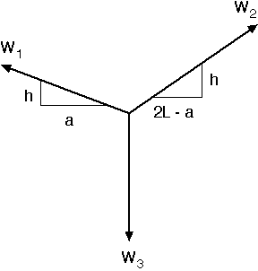
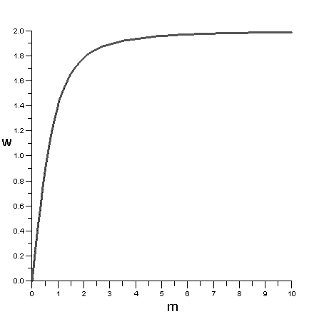

# Problem 1 #

Let's start with some simplifications that we can almost always make in pulley problems like this:

1. The tension in a string is always aligned with the string. This is because strings (ropes, cables, chains) are very flexible and cannot carry significant loads in any other direction.

2. The tension in a string wrapped around a pulley is the same on both sides of the pulley. This is approximately true when the pulley is well lubricated and offers little resistance to turning. Sometimes pulleys in textbook problems are called "frictionless pulleys" to emphasize this.

Therefore we can say at the outset that \(F_1 = W_1\) and \(F_2 = W_2\). Since the pulleys are at the same height and have "negligible" diameter (which means, in textbook-speak, that we are to assume the diameters are zero), we can draw a free-body diagram of Point A like this:

We're using \(a\) to represent the horizontal distance between Point A and Pulley 1, and therefore the horizontal distance between Point A and Pulley 2 is \(2L-a\). Equilibrium in the horizontal (x) direction requires

\[\sum F_x = W_2 \frac{2L-a}{\sqrt{(2L-a)^2 + h^2}} - W_1 \frac{a}{\sqrt{(2L-a)^2 + h^2}}= 0\]

where we've used the Pythagorean theorem to work out the horizontal components of the string tensions. Since \(W_1 = W_2\), it should be clear that \(a = 2L-a\) and therefore \(a= L\). You probably would have guessed that from the symmetry of the problem, but we've just proved it.

To get the relation between \(W_3/W_1\) and \(h/L\), we use the equation of equilibrium in the vertical (y) direction:

\[\sum F_y = W_1 \frac{h}{\sqrt{L^2 + h^2}} + W_1 \frac{h}{\sqrt{L^2+h^2}} - W_3 = 0\]

where we've used \(W_2 = W_1\) and \(a=L\) to simplify the equation somewhat. A little algebra leads us to

\[\frac{W_3}{W_1} = \frac{2 h}{\sqrt{L^2+h^2}}\]

which is almost what the problem calls for. We need to divide the top and bottom of the right-hand-side of the equation by \(L\) to get it into this form

\[\frac{W_3}{W_1} = \frac{2 (h/L)}{\sqrt{1+(h/L)^2}}\]

which is the answer in the back of the book (except that I prefer to use an upper case \(L\) to avoid confusion with the numeral 1).

Plotting the result is pretty simple if you have a spreadsheet or some math software. We'll substitute \(w = W_3/W_1\) for the weight ratio, and \(m= h/L\) for the slope of the string to make the equation smaller.

\[w = \frac{2m}{\sqrt{1 + m^2}}\]

Before we do any plotting, we should note that as \(m\) gets larger (that is, as the strings get closer to vertical), \(w\) gets closer to 2, a result that should make sense to you and should give you confidence in our solution (the back of the book is not always right!). It might also be nice to rearrange this equation to solve for the slope in terms of the weight ratio.

\[ m = \frac{w}{\sqrt{4 - w^2}} \]

Put this way, it becomes clear that the weight ratio cannot exceed 2. Physically, if the center weight were more than the sum of the other two weights, the system could not remain in equilibrium. The center weight would pull the other two up and over their pulleys.

Here's the plot of the relationship.

The asymptote at \(w=2\) matches our physical understanding of the problem.
