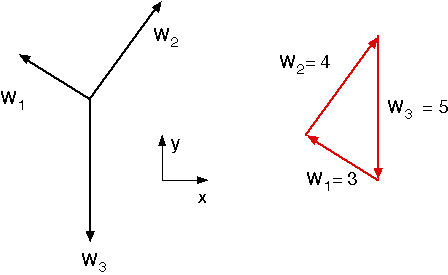
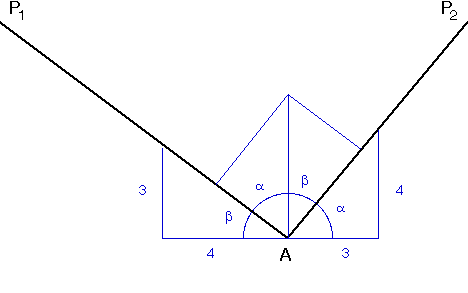

# Problem 2 #

Here we have the same pulley system as in Problem 1, but with \(W_1 = 3\)lbs, \(W_2 = 4\)lbs, and \(W_3 = 5\)lbs. Although we could follow basically the same procedure as we did in Problem 1, but with \(W_1 \not= W_2\), the solution will get messy. Here, the best approach is to take advantage of the fact that there are only three forces acting at Point A and use what we know about triangles. (We could have used this same approach in Problem 1, but it wouldn't have saved us much effort.)

Instead jumping right into the equations of equilibrium, we'll first assemble a *polygon of forces* by putting the component force vectors tip to tail. Equilibrium requires that the vectors, when drawn at the correct angles and with lengths equal to their magnitudes, form a closed polygon. In this case, the polygon is a triangle because there are only three forces.

I'm guessing that you've seen enough triangles in your life to recognize that this is a right triangle ( \(3^2 + 4^2 = 5^2\) ). If you haven't, learn to recognize it quickly; the 3-4-5 triangle is a favorite of teachers and textbooks because its side lengths are all integers. Multiples of the 3-4-5, like the 6-8-10 and the 4.5-6-7.5, are also favorites. Somewhat less popular, but still something you're likely to see, is the 5-12-13 triangle.

Once we see that this is a 3-4-5 triangle, our problem is basically done. The angle at A between the two portions of the string is clearly 90°. The string itself is easily plotted using complementary angles in the construction below.

