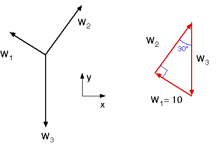

# Problem 3 #

This one's a lot like Problem 2, except that instead of being given all the weights and figuring out the angles (or slopes), we're given a mixture of the weights and angles and will have to figure out the rest.

The angle at A between the two parts of the string is still 90°, which is nice, because right triangles are easy to work with. The free-body-diagram and polygon of forces at A is shown below.

The remaining weights are easily calculated by trigonometry:

\[W_3 = \frac{W_1}{\sin 30} = \frac{10}{0.5} = 20\:\rm{lbs}\]

and

\[W_2 = W_3 \cos 30 = 20\cdot(0.866) = 17.32\:\rm{lbs}\]
