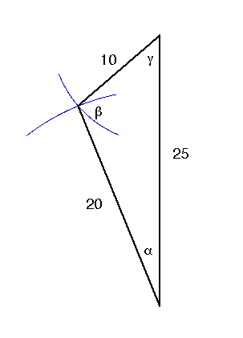

# Problem 4 #

Same pulley system as in Problems 1---3, but this time we have \(W_1= 20\:\rm{lbs}\), \(W_2= 10\:\rm{lbs}\), and \(W_3= 25\:\rm{lbs}\). This is a bit annoying, because our polygon of forces will no longer be a right triangle. What to do?

Well, the book says to use "graphical construction" and use a protractor to measure the angles of the string. Remember, this book was written almost 60 years ago, when engineering students were expected to know how to draw. A student back then would pull out his (yes, almost always *his*) trusty compass and scale, lay off a vertical line of 25 units, then scribe a 20-unit-radius arc from the bottom of the vertical line and a 10-unit-radius arc from the top. Where the arcs cross is the third corner of the triangle. Draw in the other two sides of the triangle and measure the angles. Easy.

A method more comfortable to today's student would be to use the [law of cosines][mw], the generalization of the Pythagorean theorem to non-right triangles.

\[ 10^2 = 20^2 + 25^2 - 2\cdot20\cdot25 \cos \alpha \]

which gives us \(\alpha = \cos^{-1} 0.925 = 22.3^\circ \), which is the angle between the left part of the string and the vertical. Similarly,

\[ 20^2 = 10^2 + 25^2 - 2\cdot10\cdot25 \cos \gamma \]

which gives us \(\gamma = \cos^{-1} 0.65 = 49.5^\circ \), which is the angle between the right part of the string and the vertical.

[mw]: http://mathworld.wolfram.com/LawofCosines.html
