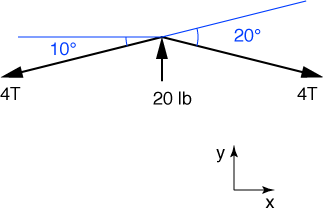
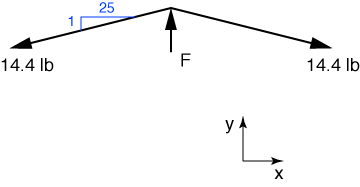

# Problem 5 #

This is one of those problems where it's easy to make a silly mistake and be off by some integer multiplier. For part a, we draw the free-body diagram of point B (the top of the violin's bridge) as shown below.

There are three things to notice about this drawing:

1. We're drawing all four strings as a single line. To make sure our answer isn't off by a factor of four, we call the tension in this four-pack of strings 4T rather than just T. That way, when we solve for T we get the tension in each individual string, which is what is asked for.

2. We're aligning the axes so that the string tensions on either side of the bridge are at the same angle to the axes. This gives the problem a symmetry that cuts down on some of our work.

3. Because the string tension is constant across the bridge and because of our choice of axes, equilibrium in the x-direction requires the bridge force of 20 lbs to be aligned with the y-axis. Now we only have to deal with equilibrium in the y-direction.

The equilibrium equation is

\[ \sum F_y = 20 - 4 T \sin 10 - 4 T \sin 10 = 0 \]

and the solution is

\[ T = \frac{20}{8 \sin 10} = 14.4\:\rm{lb} \]

which is our answer for part a.

Part b is similar. First, we align our axes with the force deflecting the string. The slope of the string with respect to these axes is \(0.25/6.25 = 1/25\) (recall that the string is 12.5 inches long and the 0.25-inch deflection is at its midpoint).

The equation of equilibrium in the y-direction is

\[ \sum F_y = F - 2 \left[ 14.4 \left( \frac{1}{\sqrt{626}} \right) \right] = 0 \]

and the solution is \( F = 1.15\:\rm{lb}\).
