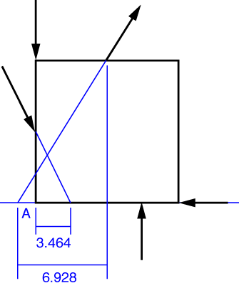
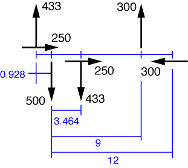

# Problem 6 #

We're going to cheat a bit on this one. At the point in the book where this problem is assigned, you're not supposed to know about moments. You're supposed to determine the resultant force and its location by a sequence of parallelogram-of-forces constructions--starting with two of the applied forces, get their resultant, then get the resultant of that force with the third applied force, and so on until all the applied forces are exhausted. This is, frankly, a pain in the ass, especially for students who haven't had the drafting experience that the students of 60 years ago had. So we're going to pretend that this problem was assigned after moments are covered.

The easiest way to do this problem is to project all the forces down onto the line that runs along the bottom edge of the plate (which we'll call the "baseline" of this problem). We can do this because a force has the same effect acting at any point along its line of action.

We now break each of the angled forces into its horizontal and vertical components and draw them in on that line.

We've drawn the horizontal forces a bit above or below their actual lines of action so they don't blend in with the baseline. Our calculations will account for the fact that they run along the baseline.

The horizontal component of the resultant force is

\[ R_x = 250 + 250 - 300 = 200\:\rm{lb}\]

which is 200 lb to the right. The vertical component of the resultant is 

\[ R_y = 433 - 500 - 433 + 300 = -200\:\rm{lb} \]

which is 200 lb down. To resultant is therefore \( \sqrt{200^2 + 200^2} = 283\:\rm{lb} \) acting at a 45° angle down and to the right.

The location of the resultant force can be described in many ways. Because we went to the effort of projecting all the applied forces down the baseline, we're going to determine where the line of action of the resultant intersects that baseline. (Because the resultant is at a 45° angle, it must intersect the baseline somewhere.) We can assume, with no loss of generality, that the resultant force acts at that intersection point.

To get the intersection point, we first take sum the moments of the applied forces about Point A, the lower left corner of the plate:

\[ M_A = -433\cdot0.928 - 433\cdot3.464 + 300\cdot9 = 798.1\:\rm{in\cdot lb} \]

where we've taken counterclockwise as positive. This must be the same as the moment about A produced by the resultant. Because the horizontal component of the resultant acting at the intersection point passes through Point A, it contributes nothing to the moment about A. Therefore, the downward component of 200 lb must have a lever arm of \(798.1/200 = 3.99\:\rm{inches}\) to produce that moment, and it must act to the left of Point A for the moment to be counterclockwise. The line of action of the resultant force, then, intesects the baseline of the plate 3.99 inches to the left of the bottom left corner.
