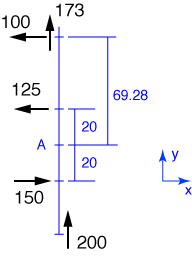

# Problem 7 #

Taking an approach similar to the [previous problem][1], we project all the applied forced along their lines of action to a common baseline. In this case, the baseline will be the line of action of the 200-ton force that is pushing the ship to the left (OK, *port*) and is perpendicular to the ship's fore-and-aft centerline.

Again, I've drawn the forces a bit off the baseline so they're easier to see.

The component of the resultant force in the x-direction is

\[ R_x = 150 - 125 - 100 = -75\:\rm{tons} \]

or 75 tons in the aft direction. The component of the resultant force in the y-direction is

\[ R_y = 173 + 200 = 373\:\rm{tons} \]

or 373 tons to port. The resultant, therefore has a magnitude of \(\sqrt{75^2 + 373^2} = 381\:\rm{tons} \) and acts back and to the left at an angle of \( \tan^{-1} (373/75) = 78.6^\circ \) to the centerline of the ship.

As before, we use moments to determine the line of action of the resultant force. The moment of the applied forces about Point A is

\[ M_A = 150 \cdot 20 - 125 \cdot 20 + 100 \cdot 69.28 = 12,428\:\rm{ft \cdot tons} \]

in the counterclockwise direction. The resultant force must generate this same moment about A. Because the line of action is not parallel to the centerline of the ship, we can assume the resultant acts at the centerline. (Recall that a force has the same effect no matter where it acts along its line of action. We are therefore allowed to choose a location for the force along that line that makes our calculations easy.) With that location, the x-component of the resultant contributes nothing to the moment about A and the lever arm of the y-component must be \( 12,428/373 = 33.3\:\rm{ft} \) forward of Point A. This is \( 80 - 33.3 = 46.7\:\rm{ft} \) behind the bow of the ship.

[1]: problem006.html
