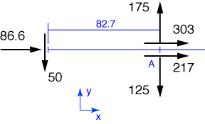

# Problem 8 #

In this problem, we'll start by projecting all of the applied forces along their lines of action to the centerline of the barge.

The towline forces, when projected onto the baseline, act at a distance \(10 / \tan 30^\circ = 17.3\:\rm{ft} \) back from the bow, which is 82.7 ft from the stern.

The x-component of the resultant force is 

\[ R_x = 86.6 + 303 + 217 = 606\:\rm{lb} \]

and the y-component of the resultant is

\[ R_y = 175 - 125 - 50 = 0 \]

so the resultant is 606 lb in the forward direction.

The moment of the applied forces about Point A (where the towline forces intersect) is

\[ M_A = 50 \cdot 82.7 = 4,134\:\rm{ft \cdot lb} \]

and the resultant must generate that same counterclockwise moment. Because the resultant is parallel to the centerline of the barge and in the forward, it must act at a distance \(4134/606 = 6.82\:\rm{ft}\) to the right of the centerline. The back of the book has it as 3.17 ft inboard from right side, which is (except for some roundoff error in the last digit) the same thing.
