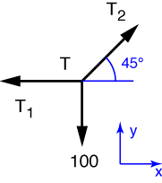
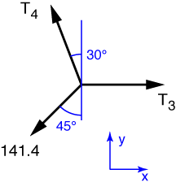

# Problem 9 #

This is a classic sort of problem, an academic exercise that isn't really based on a real-world example. You're likely to see problems like this in textbooks today.

We start with the point from which the 100 lb weight is hung. The free-body diagram of this point looks like this

The equilibrium equation for the y-direction is

\[ \sum F_y = \frac{T_2}{\sqrt{2}} - 100 = 0 \]

from which we learn that \(T_2 = 141.4\:\rm{lb}\). Using this result in the equilibrium equation in the x-direction

\[ \sum F_x = -T_1 + \frac{T_2}{\sqrt{2}} = 0 \]

gives us \(T_1 = 100\:\rm{lb}\).

We now move to the other point and draw the free-body-diagram

Equilibrium in the y-direction gives us the equation

\[ \sum F_y = T_4 \frac{\sqrt{3}}{2} - 100 = 0 \]

from which we get \( T_4 = 200/\sqrt{3} = 115.5\:\rm{lb} \). Using this in the equilbrium equation for the x-direction

\[ \sum F_x = T_3 - \frac{T_4}{2} - 100 =  0 \]

gives us \( T_3 = 100/\sqrt{3} + 100 = 157.7\:\rm{lb} \).
