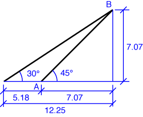

# Problem 11 #

Most of the work of this problem is figuring out the geometry of the boom and rope. With the 10 ft boom at a 45° angle, its horizontal and vertical projections are both \( 10\cdot\sin 45^\circ = 10/\sqrt{2} = 7.07\:\rm{ft} \). This is equal to the vertical projection of the rope; the horizontal projection of the rope is therefore \( 10/\sqrt{2}\cdot\cot 30^\circ = 10\sqrt{3}/\sqrt{2} = 12.25\:\rm{ft} \). The difference of the horizontal projections is 5.18 ft, which is the distance between Point A and the lower anchor point of the rope.

To determine the moment of the rope tension about Point A we can do one of two things:

1. figure out the perpendicular distance between the rope and Point A and use that as the lever arm of the force; or

2. determine the horizontal and vertical components of the rope tension, assume that they act at a convenient point along the line of action, determine the horizontal and vertical distances of that point from Point A, and use those as the lever arms of the force components.

Although it takes more time to write out the second option, it takes less time to do, especially if we're clever about where we assume the force acts. (Remember, we can assume that a force acts at any point along its line of action.)

Assume the force acts at the rope's lower anchor point. The horizontal component of the force will have a lever arm of zero, so the moment contributed by the horizontal component will be zero--we don't have to bother calculating the magnitude of the horizontal component. The vertical component of the force is \( 1000\cdot\sin^\circ = 500\:\rm{lb} \), so the moment about Point A is \( 500\cdot 5.18 == 2588\:\rm{ft\cdot lb} \) counterclockwise (it's pulling back on Point B and tending to turn the boom in the CCW direction). This is the answer to part *a*.

Part *b* is easier. The weight acts straight down and its moment about Point A is \( (7.07\:\rm{ft}) W\) clockwise. Den Hartog gives the answer as \(7.07W\:\rm{ft\cdot lb}\), which is, strictly speaking, only correct if W is given in pounds. Our answer is correct regardless of the units of W.

For part *c*, we equate the two moments: 

\[ 2588\:\rm{ft\cdot lb} = (7.07\:\rm{ft}) W \]

so

\[ W = \frac{2588\:\rm{ft\cdot lb}}{7.07\:\rm{ft}} = 366\:\rm{lb} \]

I've been very careful in this problem to carry the units along to show how the units of W arise naturally from the calculation. Normally, if the problem is simple and the units are consistent, I don't bother writing down the units in the intermediate calculations.
