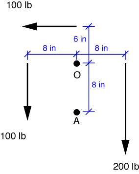
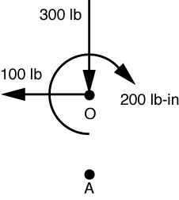

# Problem 12 #

The point and forces of interest are laid out as follows:

Taking clockwise as positive, the moment about the pulley center, O, is

\[ M_O = 200 \cdot 8 - 100 \cdot 8 - 100\cdot 6 = 200\:\rm{lb}\cdot\rm{in} \]

which is the answer to part (a). We could do essentially the same thing to get the moment about point A, but just to throw in a bit of variety, we'll start by taking the static equivalent of the forces at O

and transforming the moment to point A:

\[ M_A = M_O - 100 \cdot 8 = 200 - 800 = -600\:\rm{lb}\cdot \rm{in} \]

or \(600\:\rm{lb}\cdot \rm{in} \) counterclockwise. This is the answer to part (b).
