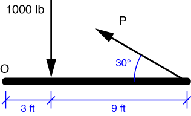

# Problem 14 #

There are two ways to go about solving this problem: 

1. we can find the perpendicular distance from the line of action of force P to point O; or
2. we can break P into its horizontal and vertical components and find their individual moments about O.

The second way seems a bit faster because the horizontal component of P runs right through O and does not contribute to the moment about O. Thus, the sum of the moments about O (clockwise positive) is:

\[ \sum M_O = 1000 \cdot 3 - (P \: \sin 30^\circ) \cdot 12 = 0 \]

We solve this equation for P to get \( P = 3000 / 6 = 500\: \rm{lb} \).
