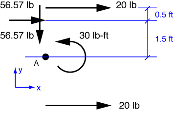

# Problem 15 #

Let's start this one by translating the rower's forces along their lines of action to the stern of the boat. We'll also decompose the pusher's angled force into its two perpendicular components. The couple can be put anywhere, so we'll move it back toward the stern, too. Here is our equivalent force system

The components of the resultant force at the stern are easily calculated.

\[ R_x = 20 + 20 + \frac{80}{\sqrt{2}} = 96.57\:\rm{lb} \]

and

\[ R_y = -\frac{80}{\sqrt{2}} = -56.57\:\rm{lb} \]

Therefore, the resultant force has a magnitude of

\[ \sqrt{96.57^2 + (-56.57)^2} = 111.9\:\rm{lb} \]

and points forward and to the right at an angle of 

\[ \tan^{-1}\frac{56.57}{96.57} = 30.36^\circ \]

from the centerline of the boat.

To get the location of the resultant force, we need to consider the moments. The resultant moment about the center of the stern, which we'll call Point A, is

\[ M_A = 30 - \frac{80}{\sqrt{2}}\cdot 1.5 = -54.85\:\rm{lb \cdot ft} \]

Only \(R_x\) contributes any moment about A, so the intersection of the line of force of the resultant with the line of the stern is

\[ \frac{-54.85}{96.57} = -0.57\:\rm{ft} \]

from A. On our diagram, this would be 0.57 ft (6.82 in) below Point A; on the boat, it would be 0.57 ft to the right (OK, *starboard*) of Point A.

This is a perfectly good answer, but unfortunately, Den Hartog prefers to tell us where the resultant intersects the centerline of the boat, not where it intersects the stern. So to check our answer against his, we need to do a little trigonometry.

\[ 6.82 \cot 30.36^\circ = 6.82 \frac{96.57}{56.57} = 11.64\:\rm{in} \]

So the line of action of the resultant force intersects the centerline of the boat 11.64 inches forward of the stern. We now have our answer in a form that agrees with Den Hartog.
