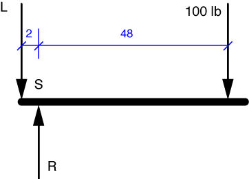

# Problem 17 #

This is another easy one if we go about it right. We don't know the reaction force, R, and we're not required by the problem statement to find it. Our best strategy for finding L, then, is to try to use an equilibrium equation that includes L but doesn't include R. 

That equation will be the one for moment equilibrium about Point S.

\[ \sum M_S = 2L - 100 \cdot 48 = 0 \]

Solving this equation, we get L = 2400 lb.
