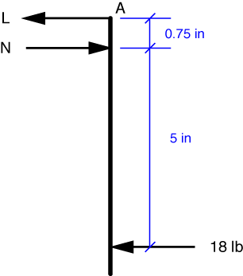

# Problem 18 #

Let's start with a simplified free-body diagram of the right arm of the nutcracker.

Since perpendicular distances are all we care about, we don't have to worry about the curved part of the arm. Also, since the nutcracker is symmetric and the applied forces are symmetric, the solution will be symmetric. So the forces acting on the left arm will be mirror images of the forces acting on the right arm: equal in magnitude and opposite in direction.

To get the force acting on the nut, *N*, we take the moments about point A. This keeps the unknown link force, *L*, out of the equation. The moment equilibrium equation is

\[ \sum M_A = 18\:\cdot\:5.75 - N\:\cdot\:0.75 = 0 \]

which we solve to find *N* = 138 lb, which is the answer to part a).

We use this result in the horizontal force equilibrium equation,

\[ \sum F_x = 138 - 18 - L = 0,\]

to solve for the link force, *L* = 120 lb to the left. This is the answer to part b).

Note that *L* is the force the link is exerting on the arm. By Newton's Third Law, we know that the force the right arm is exerting on the link is 120 lb to the right. And by the mirror symmetry mentioned above, we know that the force the left arm is exerting on the left end of the link is 120 lb to the left. Thus, the link is being pulled by 120 lbs at each end, and we say that the link is under 120 lbs of *tension*.

Similarly, the nut is being squeezed by a pair of forces and we say that it is under 138 lbs of *compression*.

It's also worth noting that because we get 138 lbs of nutcracking force out of an applied force of just 18 lbs, the nutcracker is said to provide a *mechanical advantage* of \(138/18 = 5.75/0.75 = 7.67\).
