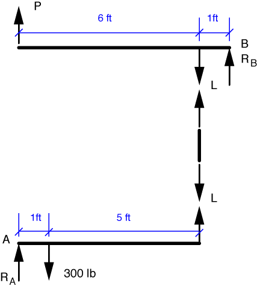

# Problem 23 #

This is a problem where free-body diagrams will definitely come in handy. So let's start by showing FBDs of the three pieces of this double lever system: the top lever, the bottom lever, and the link between them.

I've taken the liberty of solving the equilibrium problem for the link as I drew its FBD. The link is what is often called a *two-force member*. As you might expect, a two-force member has exactly two forces acting on it. Force equilibrium requires that the two forces be equal in magnitude and opposite in direction. ("Equal and opposite" is usually used in connection with Newton's Third Law, but with two-force members, equal and opposite comes from equilibrium.) Moment equilibrium requires that they lie on the same line of action. So when we encounter a bar with forces applied only at the ends, we can say immediately that the forces run along the bar and are equal and opposite. For the link in this problem, we'll call those forces *L*.

The link forces we just described are the forces the upper and lower levers exert on the link. By Newton's Third Law, we know that the forces the link exerts on the upper and lower levers are equal and opposite. So those forces are also *L*.

We'll start with the lever we know the most about, which is the bottom one. Moment equilibrium about the pivot point at the left end gives us

\[ \sum M_A = 300\,\cdot\,1 - 6 L = 0 \]

and a solution of *L* = 50 lb.

We can use this result in the equilibrium equation for moments about the right pivot in the top lever.

\[ \sum M_B = 7 P - 50\,\cdot\,1 = 0 \]

Solving this gives us *P* = 7.14 lb, which matches the answer in the back of the book.

Notice that since we weren't asked to determine \(R_A\) or \(R_B\), we took our moments about A and B, which kept the pivot reaction forces out of our equilibrium equations. This is a solution strategy we'll use again and again.
