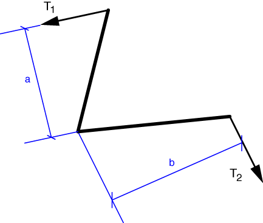

# Problem 24 #

For part a), we'll just use the drawing of the left bellcrank as our free-body-diagram. Taking the moments about the pivot point, which we'll call O, we get the equilibrium equation

\[ \sum M_O = T_1 a - T_2 b = 0 \]

and the relationship

\[ T_1 a = T_2 b. \]

For part b), we'll need to do some drawing. To get the same equilibrium relationship, we need to define *a* and *b* as the perpendicular distances from the pivot point to the lines of action of \(T_1\) and \(T_2\).

