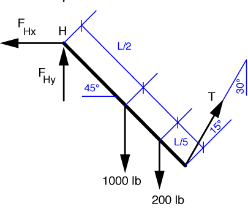

# Problem 25 #

The free-body-diagram of the ladder looks like this

Taking moments about the hinge, H, we get the equilibrium equation

\[ \sum M_H = 1000\frac{L}{2} \sin 45^\circ + 200 \frac{4 L}{5} \sin 45^\circ - T \cos 15^\circ L = 0 \]

where *T* cos 15° is the component of the rope tension perpendicular to the ladder. Because the unknown length of the ladder, *L*, is common to all terms, it drops out of the equation, and we can solve for the rope tension, *T* = 483 lbs.

We can get the two components of the hinge force from the two force equilibrium equations. For horizontal forces

\[ \sum F_x = 483 \sin 30^\circ - F_{Hx} = 0 \]

and \(F_{Hx} = 242\:\rm{lbs}\). For vertical forces

\[ \sum F_y = 483 \cos 30^\circ - 1000 - 200 + F_{Hy} = 0 \]

and \(F_{Hy} = 782\:\rm{lbs}\). Except for some roundoff--which I'm going to attribute to some sloppy slide rule work by one of Den Hartog's grad students--these answer match those in the back of the book.
