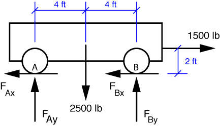

# Problem 26 #

The free-body-diagram for the jeep looks like this:

To get the vertical force on the front axle, we take moments about the rear wheel contact point, B:

\[ \sum M_B = 1500\,\cdot\,2 - 2500\,\cdot\,4 + 8 F_{Ay} = 0 \]

From this equilibrium equation we get \(F_{Ay} = 875\,\rm{lbs}\). To get the vertical force on the rear axle, we use this answer in the vertical force equilibrium equation:

\[ \sum F_x = 875 + F_{By} - 2500 = 0 \]

From this we get \(F_{By} = 1625\,\rm{lbs}\).

Notice that Den Hartog doesn't ask us to determine the horizontal components of \(F_A\) and \(F_B\). Good thing, too, because there isn't enough information to do so. We can easily figure out that the sum of the two horizontal forces is 1500 lbs, but that's as far as we can go. Look back at the FBD: there are four unknown forces acting on the jeep. Since we only have three equations of planar statics, the mathematics won't allow us to get a solution for all four unknowns.
