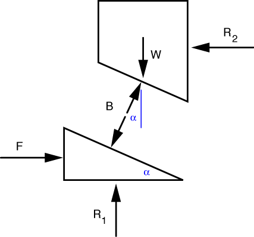

# Problem 27 #

Whenever you see rollers in a problem like this, you're to assume that the force acting through the rollers is perpendicular to the surface(s) the rollers are rolling on. For this problem we use this convention to draw our free-body-diagrams like this:

We've used Newton's Third Law to set the forces between the two blocks equal and opposite to each other.

Looking at the upper block first, we write the force equilibrium equations as

\[ \sum F_x = B \sin \alpha - R_2 = 0 \]

and

\[ \sum F_y = B \cos \alpha - W = 0 \]

From the second of these, we see that the \(B = \frac{W}{\cos \alpha}\), which is one of the answers to part b). Another answer to part b) comes from substituting this into the first equation to get \(R_2 = W \tan \alpha\).

We use the expression for *B* to write the force equilbrium equations for the lower block as

\[ \sum F_x = F - B \sin \alpha = F - W \frac{\sin \alpha}{\cos \alpha} = F - W \tan \alpha = 0 \]

and

\[ \sum F_y = R_1 - B \cos \alpha = R_1 - W = 0 \]

The first of these gives us the answer to part a): \(F = W \tan\alpha\). This allows us to rewrite our expression for \(R_2\) as \(R_2 = F\), which matches the answer in the back of the book. (We also could have gotten this answer from horizontal equilibrium of the two blocks taken as a whole.) The second gives us another one of the answers to part b): \(R_1 = W\).

You may have noticed by now that our solution for *B* doesn't seem to match the one in the back of book, which is \(B = \sqrt{F^2 + W^2}\). But the apparent mismatch disappears with a bit of algebra and trig:

\[ B = \sqrt{F^2 + W^2} = \sqrt{W^2 (\tan^2 \alpha + 1)} = \sqrt{W^2 \sec^2 \alpha} = \frac{W}{\cos \alpha} \]

As for part c), we want

\[ \frac{F}{W} = \tan\alpha = \frac{1}{10} \]

so \(\alpha = \tan^{-1}\frac{1}{10} = 5.71^\circ = 5^\circ 43'\).
