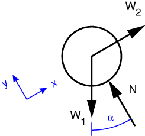

# Problem 28 #

Equilibrium of the hanging weight tells us at a glance that the tension in the cable is \(W_2\), so I'm not going to bother with free-body-diagram of that part. Also, if you recall the discussion at the beginning of [Problem 1][1], the tension will be the same on both sides of the frictionless pulley. So our FBD of the weight on the inclined plane looks like this:

Because the inclined plane is also frictionless, the force it exerts on the weight is perpendicular to the plane. When we start doing friction problems in Chapter 6 (which seems a long way off at the pace I'm going), we'll learn that this force is usually called the *normal force*, which is why we're calling it *N*. ("Normal" in this case meaning "perpendicular", not "regular.")

Since two out of the three forces acting on the weight are aligned with the plane it's helpful to align our axes with it. With these axes, the equilibrium equation along the incline is

\[ \sum F_x = W_2 - W_1\,\sin\alpha = 0 \]

and the solution is \(W_2 = W_1\,\sin\alpha\), which is the answer to part a). Since we weren't asked to determine *N*, we don't need to use the other force equilibrium equation. This, by the way, is why aligning the axes with the incline was a good idea--if we hadn't, we'd have to solve simultaneous equations.

For part b), we just plug and chug:

\[ W_2 = 50\,\sin30^\circ = 50\,\cdot\,\frac{1}{2} = 25\,\rm{lbs} \]

[1]: problem001.html

