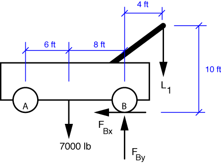
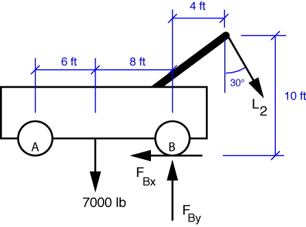

# Problem 29 #

When the truck is on the verge of tipping, the front wheels will start to lift off the ground and the forces at the front wheels will be zero. Using this fact, we draw the free-body-diagram for part a) like this:

The equilibrium equation for moments about point B is

\[ \sum M_B = 4\,L_1 - 7000\,\cdot\,8 = 0 \]

and the solution is \(L_1 = 14,000\,\rm{lbs}\).

The FBD for part b) is

and the moment equilibrium equation is

\[ \sum M_B = 4\,L_2\,\cos 30^\circ + 10\,L_2\, \sin 30^\circ - 7000\,\cdot\,8 = 0 \]

and the solution is \(L_2 = 6,616\,\rm{lbs}\). Again, I attribute the weird roundoff error in Den Hartog's answer to difficulties in getting the third significant digit on a slide rule.

