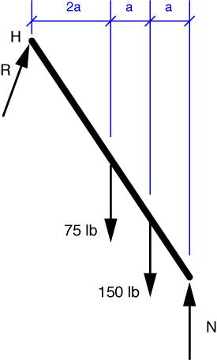

# Problem 30 #

The free-body-diagram for the ladder is shown below. Notice that

1. The force at the floor is purely vertical because there's a frictionless wheel at the bottom of the ladder.
2. The reaction force at the wall is drawn at an (unknown) angle because the hinge there can transmit both vertical and horizontal components of force. As we shall see, the angle won't enter into our equations because of what we are asked to calculate.

The equilibrium equation for moments about the hinge is

\[ \sum M_H = 75(2a) + 150(3a) - N(4a) = 0 \]

and the solution is \(N = 150\,\rm{lbs}\).

