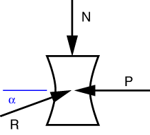
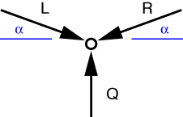

# Problem 31 #

The first thing to notice in this problem is that the two arms of the toggle are two-force members (which you may recall from [Problem 23][1]), so the forces transmitted by those arms must be aligned with them. We draw the free-body-diagram of the rolling block at the right end of the toggle like this

The horizontal equilibrium equation is

\[ \sum F_x = R \cos \alpha - P = 0 \]

which tells us that \(R = P/\cos\alpha\). We can now draw an FBD of the hinge at the center of the toggle

The equilibrium equations for the hinge are

\[ \sum F_x = L \cos\alpha - R \cos\alpha = 0 \]

and

\[ \sum F_y = Q - L \sin\alpha - R \sin\alpha = 0 \]

From the first of these, and our previous solution, we see that \(L = R = P/\cos\alpha\). Plugging this into the second equation gives us

\[ Q = \frac{P}{\cos\alpha}\sin\alpha + \frac{P}{\cos\alpha}\sin\alpha = 2 P \tan\alpha \]

which is the solution at the back of the book. Notice that for small angles, *Q* will be much less than *P*. Since toggles like this are usually set up with *Q* as the applied force and *P* as the resistance, you can see how this mechanism is a great force multiplier.

[1]: problem023.html

