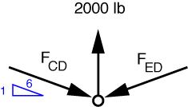
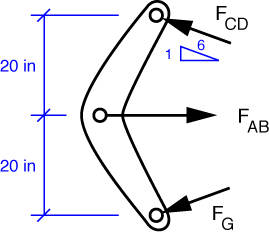

# Problem 34 #

The idea behind the free-body diagram is that the system as a whole--as well as every single piece of the system, no matter how you break it up--is in equilibrium. Every FBD is as valid as the next (as long as you draw them correctly); the trick is in choosing FBDs that get you to the answer efficiently. This problem is a good example of how to do that.

To start, we'll look at the lifting tong and the block as a single system, using the drawing in the book. There are only two forces: the weight of 2000 lbs acting down and the lifting force acting up. Clearly, the lifting force must be 2000 lbs.

Now we'll look at the pin between the links CD and ED. The FBD looks like this

Because CD and ED are two-force members, we know that the forces in those members act along the lines connecting the pins. Further, because of the tongs' symmetry, we know that the force in CD and the force in ED are the equal. Therefore, from vertical equilibrium

\[ \sum F_y = 2000 - 2 F_{CD} \frac{1}{6} = 0 \]

and the solution is

\[ F_{CD} = 6000\,\rm{lbs} \]

Now we look at the bellcrank GAC. Crossbar AB is also a two-force member, so the force it exerts on the bellcrank must be horizontal. The FBD is

The force at C is known; the direction of the force at A is known but its magnitude is unknown (and is what we are being asked to find); the force at G is unknown in both magnitude and direction. The best strategy, then is to take moments about G to get an expression with the one unknown we are trying to determine.

\[ \sum M_G = 40 \frac{\sqrt{6^2 - 1^2}}{6} 6000 - 20 F_{AB} = 0 \]

The solution is \(F_{AB} = 11,832\,\rm{lbs}\). The answer in the back of the book is 11,840, which is about as close as you can get (three significant digits) using a slide rule.

The horizontal force at G is now easy to get from horizontal equilibrium:

\[ \sum F_x = 11,832 - \frac{\sqrt{6^2 - 1^2}}{6} 6000 - F_{Gx} = 0 \]

The solution is \(F_{Gx} = 5916\,\rm{lbs}\). Again, the answer in the back of the book is correct to three digits.

