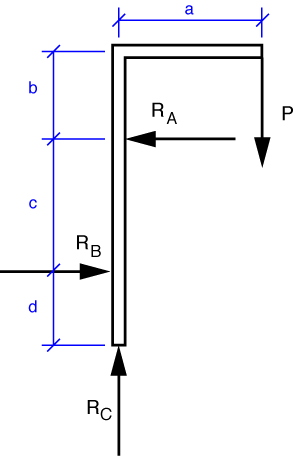

# Problem 36 #

The free-body diagram of the hoist is given below. The three reaction forces are constrained in the horizontal and vertical directions as described in the problem statement.

The vertical equilibrium equation is

\[ \sum F_y = R_C - P = 0 \]

and its solution is \(R_C = P\). The horizontal equilibrium equation is

\[ \sum F_x = R_B - R_A = 0 \]

and its solution is \(R_A = R_B\). Notice that these two solutions give us two pure couples. Therefore, the moment about any point will be the algebraic sum of the two couples:

\[ \sum M = P a - R_A c = 0 \]

and the solution is

\[ R_A = R_B = P \frac{a}{c} \]

which, except for the sign convention for the reactions at A and B, matches the answer at the back of the book.

