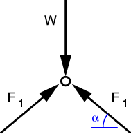
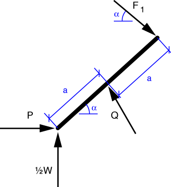

# Problem 37 #

We need to be careful with this one. It's drawn as if the bars in the linkage are perpendicular to one another, but that would only be true if the angle \(\alpha\) down at the lower left is equal to 45°.

First, we note that the two upper members of the linkage are two-force members. The two lower members, however, are not because they are pinned together at mid-length, which imposes a third force on each bar.

Through a combination of symmetry and vertical equilibrium of the entire linkage, we can say that the vertical reaction forces at the bottom of the linkage are each \(W/2\).

The free-body diagram of the pin at the top of the linkage is

We've used symmetry to set the two bar forces equal to one another, but if we hadn't noticed the symmetry we would have gotten the same result from horizontal equilibrium. The vertical equilibrium equation is

\[ 2 F_1 \sin \alpha - W = 0 \]

and its solution is

\[ F_1 = \frac{W}{2 \sin \alpha} \]

Let's now draw the FBD of one of the lower bars.

Taking moments about the center of the bar, we get

\[ \sum M_Q = F_1\cos\alpha(a \sin\alpha) + F_1\sin\alpha(a \cos\alpha) + \frac{W}{2}(a \cos\alpha) - P (a \sin\alpha) = 0 \]

Substituting in our previous solution for \(F_1\) and rearranging, we get

\[ \frac{3}{2} W a \cos\alpha = P a \sin\alpha \]

which leads to 

\[ \frac{P}{W} = \frac{3}{2} \cot\alpha \]

 
