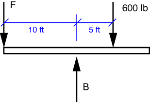
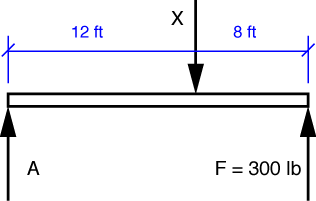

# Problem 38 #

The key to this problem is the vertical contact force between the two beams. We'll start by considering the right beam with its right end on the verge of lifting off the support at C.

The equilibrium equation for moments about B is

\[ \sum M_B = 600\cdot5 - 10 F = 0 \]

and the solution is \(F = 300\,\rm{lbs}\).

Now we look at the left beam to determine what force *X* is required to produce 300 lbs at the right end.

The equilibrium equation for moments about A is

\[ \sum M_A = 12 X - 20\cdot300 = 0 \]

and the solution is \(X = 500\,\rm{lbs}\).

