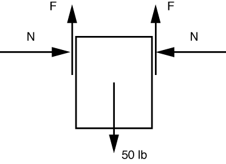
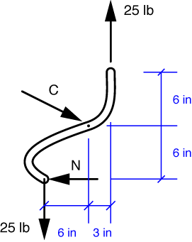

# Problem 39 #

Let's start with a free-body diagram of the block of ice.

We've used symmetry to recognize that the forces on either side of the block must be equal. The vertical equilibrium equation is

\[ \sum F_x = 2 F - 50 = 0 \]

and the solution is *F* = 25 lbs.

The FBD of one of the tong bars is

Moment equilibrium about the pin C gives

\[ \sum M_C = 25 \cdot 3 + 25 \cdot 6 - 6 N = 0 \]

The solution of this equation is *N* = 37.5 lbs, which is the answer to part a). Vertical equilibrium tells us that the vertical component of the force at C is zero, so it should be drawn as a purely horizontal force. Horizontal equilibrium tells us that *C* = 37.5 lbs, which is the answer to part b)

The Eugene O'Neill reference that starts off the problem statement is one of those little quirks that places the book in the post-war years.

