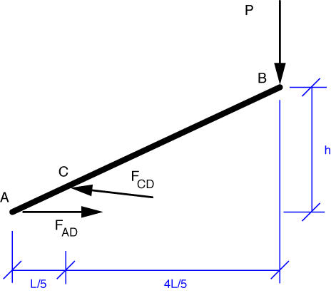

# Problem 40 #

Now here is a problem that puts us firmly in postwar America. Note the long, careful description of an everyday--but still somewhat novel--item for "us moderns." I remember aluminum ice cube trays from their last years in the 60s and early 70s, but by then the mechanism was, I think, somewhat different. Nowadays, you may find an ice cube tray like this at a flea market or antique store, next to the old issues of Life magazine.

Enough nostalgia. We're to find the tension is segment AD, which we'll call \(F_{AD}\). Because there are pins at either end and no applied forces between the pins, AD is a two-force member. So is CD. We'll use these facts to draw the free-body diagram for ACB.

Taking moments about C, we get this equilibrium equation:

\[ \sum M_C = P \cdot \frac{4 L}{5} - F_{AD} \cdot \frac{h}{5} = 0 \]

(We know the vertical distance from A to C is \(h/5\) from similar triangles.) The solution is

\[ F_{AD} = 4 \left(\frac{L}{h} \right ) P \]

which matches the solution in the book. Long description for a short problem.

