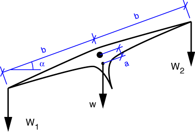

# Problem 41 #

The free-body diagram of the balance arm is

The equilibrium equation for moments about the pivot, O, is

\[ \sum M_O = W_2 b \cos\alpha - W_1 b \cos\alpha + w a \sin\alpha = 0 \]

Since Den Hartog asks only for a "relation" between \(\alpha\) and \(W_1 - W_2\), this equation could be our answer. But it's easy enough to rearrange it to

\[ \tan\alpha = \frac{W_1 - W_2}{w} \cdot \frac{b}{a} \]

which is the answer given in the book for part a).

The answer to part b) comes from studying the answer to part a). To make \(\alpha\) large, \(\tan\alpha\) must be large. And to get a large \(\tan\alpha\) when \(W_1 - W_2\) is small, \(b/a\) must be large.

