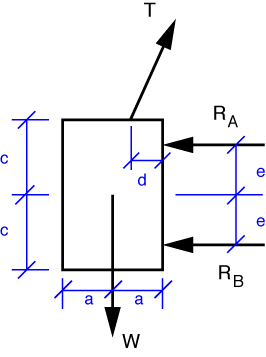
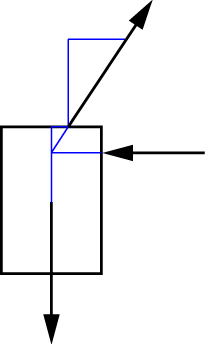

# Problem 42 #

For part a), we draw the free-body diagram of the plate,

and construct the equilibrium equations from it. Because \(R_A\) and \(R_B\) are horizontal, the vertical equilibrium equation will have just one unknown, *T*, in it:

\[ \sum F_y = T\cdot \frac{\sqrt{L^2 - (b+d)^2}}{L} - W = 0 \]

The complicated fraction in the term with *T* is the cosine of the angle between the rope and the wall. Solving for *T*, we get

\[ T = W \cdot \frac{L}{\sqrt{L^2 - (b+d)^2}} \]

To get \(R_A\), we take moments about the point B, where \(R_B\) intersects the right edge of the plate.

\[ \sum M_B = W \cdot d + \left( W  \cdot \frac{L}{\sqrt{L^2 - (b+d)^2}} \cdot \frac{b + d}{L}\right) \cdot (c+e) - W \cdot a - R_A \cdot 2e = 0 \]

The *W* in the first term is the vertical component of *T*, and the term inside the big parentheses is the horizontal component of *T*. Solving for \(R_A\), we get

\[ R_A = \frac{W}{2e} \left( \frac{(b+d)(c+e)}{\sqrt{L^2 - (b+d)^2}} - (a-d) \right) \]

which is, I think, a bit simpler than the answer in the back of the book, but algebraically equivalent.

To get \(R_B\), we can look at either horizontal equilibrium or moment equilibrium about point A, the upper wheel. I chose horizontal equilibrium:

\[ \sum F_x = W \cdot \frac{b+d}{\sqrt{L^2 - (b+d)^2}} - R_A - R_B = 0 \]

So, plugging in the previous solution for \(R_A\) and solving, we get

\[ R_B = W \cdot \frac{b+d}{\sqrt{L^2 - (b+d)^2}} - \frac{W}{2e} \left( \frac{(b+d)(c+e)}{\sqrt{L^2 - (b+d)^2}} + d - a \right) \]

or, after simplifying

\[ R_B = \frac{W}{2e} \left( (a - d) - \frac{(b+d)(c-e)}{\sqrt{L^2 - (b+d)^2}} \right) \]

which is algebraically equivalent to the answer in the back of the book. (Den Hartog uses *L* for the lower force and *l* for the length of the rope. Because I think a lower case *l* looks too much like the numeral *1*, I've used *L* for the rope length and \(R_B\) for the lower force.)

We get the answer to part b) by setting the expression for \(R_B\) equal to zero. The \(W/2e\) term cancels out and we're left with the expression in the big parentheses:

\[ \frac{(b+d)(e-c)}{\sqrt{L^2 - (b+d)^2}} + a - d = 0 \]

This can be rearranged to the answer in the book:

\[ \frac{(b+d)}{\sqrt{L^2 - (b+d)^2}} = \frac{a - d}{c-e} \]

The geometric interpretation of this expression is that the two blue triangles in the figure below are similar. The numerators represent the horizontal legs, and the denominators represent the vertical legs. If this is the case, the lines of action of the three forces meet at a point, which is an equilibrium requirement for a body acted upon by exactly three forces.

If we had done part b) first, we could have started with the requirement that the three forces meet at a point and derived the equation from that requirement.
