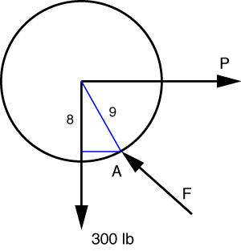

# Problem 43 #

As the roller is starting to go up over the plank, the contact force between the roller and the ground goes to zero. The free-body diagram for this condition is shown below.

To determine *P*, we take moments about A, the contact point between the plank and the roller.

\[ \sum M_A = P \cdot 8 - 300 \cdot \sqrt{9^2 - 8^2} = 0 \]

The solution is *P* = 155 lbs, which, except for roundoff, matches the answer in the back of the book.
