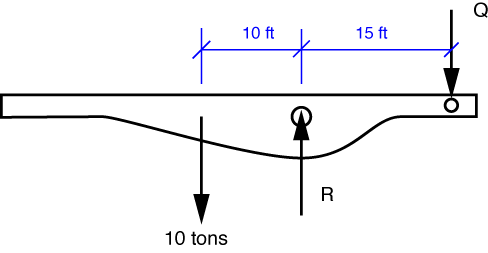

# Problem 44 #

The free-body diagram of the bridge deck is shown below.

The equilibrium equation for moments about the bridge pin, which we'll call O, is

\[ \sum M_O = P \cdot 15 - 10 \cdot 10 = 0 \]

and the solution is *Q* = 6.67 tons or 13,333 lbs. (Yes, I know that's too many significant digits--I'm carrying along some extra "placeholder" digits in the intermediate results.) The density of water is 62.4 pounds per cubic foot (pcf), so the density of the concrete in the block is \(2.5 \cdot 62.4 = 156\,\rm{pcf}\). (FYI, civil/structural engineers usual take normal-weight concrete to be 150 pcf.) To get 13,333 lbs of concrete, we need

\[ \frac{13,333}{156} = 85.5\,\rm{ft^2} \]

of concrete. This is the answer to part a).

When the bridge deck is at 30°, the moment arms of the weight and *Q* will be reduced by the same percentage (they'll be cos 30° = 0.866 times the horizontal values). So the relationship between the weight and *Q* will not change and the necessary volume of concrete will remain 85.5 cubic feet.

Notice that the bascule bridge has a four-bar linkage, just like the Dutch bridge in [Problem 33][1]. The lifting force was independent of the bridge deck angle in that problem, too.

[1]: problem033.html

