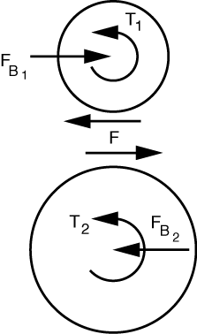
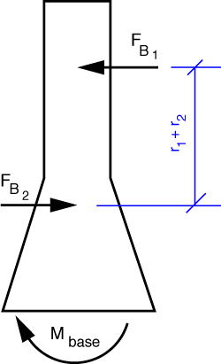

# Problem 45 #

The free-body diagrams of the gears look like this.

Newton's Third Law is the reason the two perimeter forces have the same magnitude and opposite direction.

From the upper gear, we calculate the gear-to-gear force by taking moments about the center:

\[ \sum M_{B_1} = T_1 - F \cdot r_1 = 0 \]

so \(F = T_1/r_1\). Horizontal equilibrium tells us \(F_{B_1} = F = T_1/R_1\).

We now get the resisting torque, \(T_2\), by considering the lower gear. Taking moments about its center,

\[ \sum M_{B_2} = \left( \frac{T_1}{r_1} \right) r_2 - T_2 = 0 \]

and therefore

\[ T_2 = T_1 \cdot \frac{r_2}{r_1} \]

Horizontal equilibrium of the lower gear gives us \(F_{B_2} = F = F_{B_1} = T_1/r_1 = T_2/r_2\).

The FBD of the frame is

and because the two bearing forces are equal in magnitude, opposite in direction, and act along different lines of action, they form a couple of magnitude

\[ \frac{T_1}{r_1} (r_1 + r_2) = T_1 + T_1\frac{r_2}{r_1} = T_1 + T_2 \]

Moment equilibrium of the frame tell us this couple is resisted by the reaction at the base, so \(M_{base} = T_1 + T_2\).

We could have gotten this last answer by considering the frame and gears as a whole. The gear-to-gear and bearing forces would then be internal to the system and not appear in the equilibrium equations. All that would be left are the two applied torques and the reaction moment at the base.

By the way, the drawing in the book may give you the impression that the two torques, \(T_1\) and \(T_2\), act in opposite directions. They don't. \(T_1\) is counterclockwise because it is trying to turn the upper gear counterclockwise, Under the influence of \(T_1\) and the gear-to-gear force it creates, the lower gear is trying to turn clockwise. \(T_2\) is counterclockwise because it is resisting the clockwise rotation of the lower gear.

