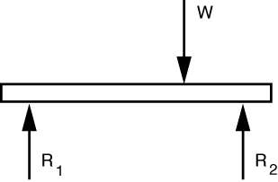
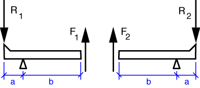
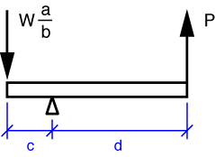

# Problem 46 #

This problem looks more complicated than it is. To show that the weight can move around on the platform without affecting the force transmitted through the short vertical link, we start with the free-body diagram of the platform.

Vertical equilibrium tells us that \(R_1 + R_2 = W\). Exactly how much \(R_1\) and \(R_2\) are depends, of course on how far to the left or right *W* is. But we won't worry about that now.

Let's move on the the FBDs of the triangular levers.

Taking moments about the pivots, we learn that \(F_1 = R_1(a/b)\) and \(F_2 = R_2 (a/b)\). The force transmitted by the short vertical link is the sum \(F_1 + F_2 = (R_1 + R_2)(a/b) = W (a/b)\). So it turns out we'll never have to worry about exactly where *W* is; the link force is independent of *W*'s position.

Moving on to *P*, we draw the FBD of the lower lever, \(L_3\).

Taking moments about the pivot, we get

\[ P = W \frac{ac}{bd} \]

