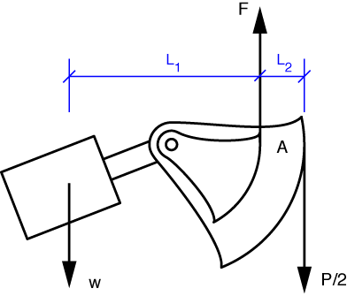
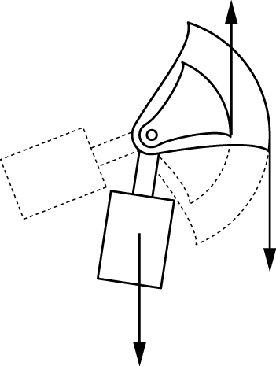

# Problem 47 #

I'm going to change slightly the notation used in this problem. In the book, Den Hartog uses upper case *W* for the weights of the pendulums. Unfortunately, he also used *W* for the load on the scale platform in [Problem 46][1], of which this problem is a continuation. So I'm going to use lower case *w* for the pendulum weights. Oh yes, I'm also going to use upper case *L*s, because lower case *l*s look too much like the numeral *1*.

The free-body diagram of the left pendulum is shown below. That the tension in the outer steel band is \(P/2\) should be obvious, so I'm not going to bother with an FBD of the equalizer bar.

Taking moments about the contact point between the inner band and the pendulum arc, A, we get this equilibrium equation:

\[ \sum M_A = \frac{P}{2} \cdot L_2 - w \cdot L_1 = 0 \]

The solution is

\[ L_1 = \frac{P}{2w}L_2 \]

The pendulum is rotated so the contact points with the bands are near the upper ends of the arcs, which puts the system near the maximum value of *P*. Since the arcs have a common center, \(L_2\) does not change as the pendulum rotates. \(L_1\), however, does change with rotation, so to show the position with half the value of *P*, we simply rotate the pendulum to halve the value of \(L_1\).

I probably should have extended the arcs further. Oh well.

[1]: problem046.html

