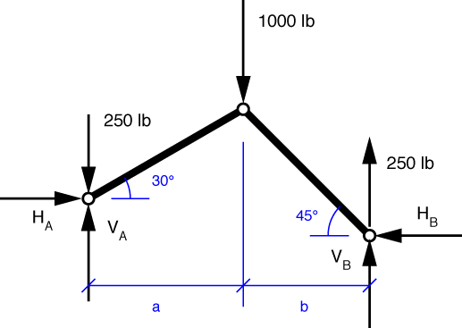
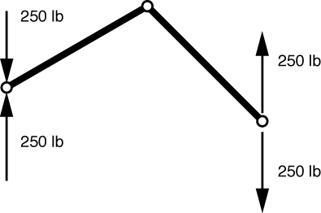
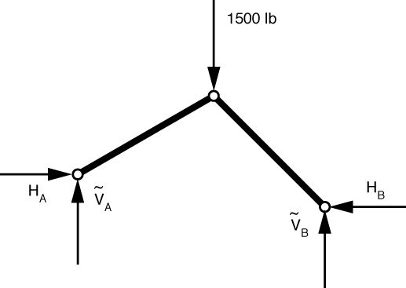
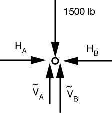

# Problem 48 #

The next five problems are pretty similar, and we'll be using similar techniques to solve them. The solutions will rely on:

1. *Static equivalence*, in which we will replace certain applied loads with other loads that have the same resultant. The support reactions that come from the application of a statically equivalent set of loads are the same as the support reactions that come from the original loads.
2.  *Superposition*, which is the principle that the effect on a structure of a set of several loads is the same a sum of the effects of the individual loads.

Our first step will be to replace the non-pin loads with a set of pin loads that have the same resultant (that are statically equivalent). The free-body diagram will be this.

Each 500 lb load at the center of a bar has been replaced with two 250 lb loads at the pins at the ends of the bars. The downward 250 lbs from the left bar and the upward 250 lbs from the right bar cancel each other at the top pin. This solution to this problem can be found by adding the solutions of this problem

(which is so trivial I've just put the solution in the FBD) and this problem

In this second sub-problem each bar is a two-force member, so the relationships between the horizontal and vertical components is known:

\[ \frac{\tilde {V}_A}{H_A} = \tan 30^\circ, \frac{\tilde {V}_B}{H_B} = \tan 45^\circ \]

The FBD of the top pin is

Horizontal equilibrium tells us that \(H_A = H_B = H\) and vertical equilibrium says

\[ 1000 = \tilde {V}_A + \tilde {V}_B = H \tan 30^\circ + H \tan 45^\circ \]

Solving for *H* gives us *H* = 634 lbs, and therefore \(\tilde {V}_A = 366\,\rm{lbs}\) and \(\tilde {V}_B = 634\,\rm{lbs}\). Adding in the results of the first sub-problem to the results of the second gives us

\[ H_A = H_B = 634\,\rm{lbs} \]

\[ V_A = 366 + 250 = 616\,\rm{lbs} \]

\[ V_B =  634 - 250 = 384\,\rm{lbs} \]

which matches the answer in the back of the book.

