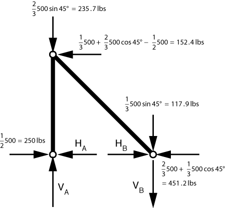
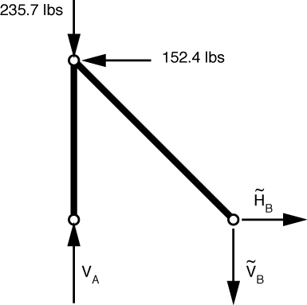
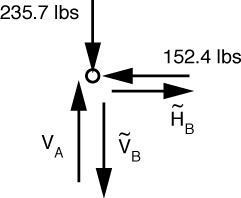
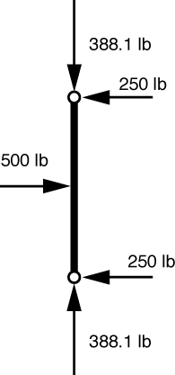

# Problem 49 #

Here again, we start by determining a statically equivalent set of loads that are applied at the pins. The free-body diagram for this set of load is

As before, we'll consider this to be the superposition of the structure with loads applied only at the lower pins (which has a trivial solution) and this problem

which has only two-force members. Because the left bar is vertical, it has only a vertical component; because the right bar is at 45°, its horizontal and vertical components are equal: \(\tilde H_B = \tilde V_B\).

The FBD of the top pin is this:

From horizontal equilibrium, we get \(\tilde H_B = 152.4\,\rm{lbs}\), which means that \(\tilde V_B = 152.4\,\rm{lbs}\). Vertical equilibrium gives us

\[ \sum F_y = V_A - 235.7 - 152.4 = 0 \]

or \(V_A = 388.1\,\rm{lbs}\).

To these answers, we add in effect of the loads applied directly to the pin supports. The results are

\[ H_A = 250\,\rm{lbs} \]

\[ V_A = 388.1\,\rm{lbs}\]

\[ H_B = 152.4 + 451.2 = 603.6\,\rm{lbs} \]

\[ V_B = 152.4 - 117.9 = 34.5\,\rm{lbs} \]

But for roundoff, these match the magnitudes given in the back of the book. The directions are reversed because Den Hartog asked for the forces imposed on the supports by the structure and we've just calculated the forces imposed on the structure by the supports.

While the reaction forces due to the statically equivalent loads are the same as the reactions due to the original loads, the *internal* forces of the structure may be different. So if, as in this problem, we are asked to calculate internal forces, we can start by using statically equivalent forces to get the reactions, but then we have to use the actual forces--including the reactions we just calculated--to determine the internal forces.

In this problem, to determine the force transmitted by the top pin, we have to go back to the original structure and loading and look at one of the bars. Either bar will do, but the left bar is easier to deal with because it's vertical. The FBD looks like this:

The forces at the bottom came from the solution we just did, and the forces at the top are pretty obvious (that's why I chose the left bar), so I put in the values without going through the equations. The force transmitted by the top pin, then is the vector sum of the components. The magnitude is

\[ \sqrt{388.1^2 + 250^2} = 462\,\rm{lbs} \]

which, except for roundoff, matches the book's answer.

