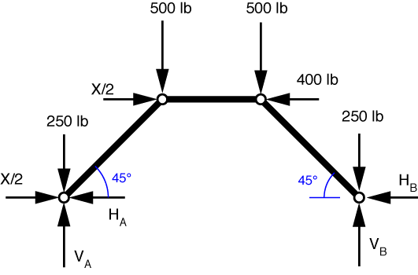
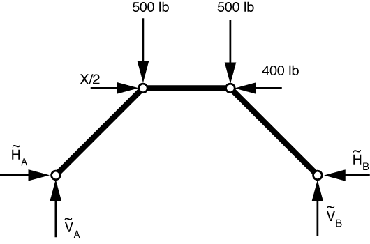
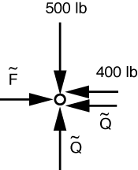
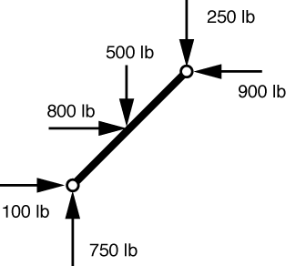
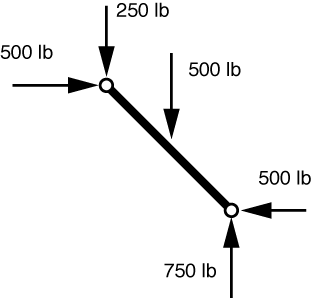

# Problem 50 #

The free-body diagram of the structure with the statically equivalent joint loads is given below.

Ignoring for the moment the loads that act directly on the supports, we get the following FBD.

It's pretty clear from this diagram that X/2 = 400 lbs, so X = 800 lbs, which is the answer in the back of the book. Symmetry also tells us that \(\tilde H_A = \tilde H_B\) and \(\tilde V_A = \tilde V_B\). To determine the other forces, we first note that with this equivalent load system, all three bars are two-force members (that's why we chose to transform the mid-bar forces to the joints), and therefore \(\tilde H_A = \tilde V_A = \tilde V_B = \tilde H_B = \tilde Q\), and the top bar force, \(\tilde F\) is horizontal.

We can then draw the FBD of the upper left pin:

Vertical equilibrium tells us that \(\tilde Q = 500\,\rm{lbs}\). Horizontal equilibrium gives us \(\tilde F = 900\,\rm{lbs}\).

Using superposition, we now combine the reaction forces just calculated with the reactions from the loads that act directly on the supports to get

\[ H_A = 400 - 500 = -100\,\rm{lbs} \]

\[ V_A = 250 + 500 = 750\,\rm{lbs} \]

\[ H_B = 500\,\rm{lbs} \]

\[ V_B  = 250 + 500 = 750\,\rm{lbs} \]

The negative sign in the answer for \(H_A\) means that it acts to the right, rather than to the left as we've drawn it. These match the answers given in the back of the book.

Now that we have the support reactions, we can use the actual applied loads (as opposed to the fictitious statically equivalent loads we've been using) to determine the forces transmitted by the upper pins. For the left pin, we use the FBD of the left bar

The equilibrium problem here is simple enough that I've just put the solution into the FBD. The forces at the upper end of the bar are the forces transmitted to it by the pin, and match the answers given in the back of the book.

Similarly for the right pin, we use the FBD of the right bar.

Again, the equilibrium of the bar is such a simple problem that I've included the solution in the FBD. The vertical force transmitted by the pin is 250 lb. In this case, however, it's not so easy to determine the horizontal force transmitted by the pin because there is a 400 lb horizontal load right at that joint. Is it applied to the horizontal bar? to the sloping bar? partly to one and partly to the other? The problem statement doesn't tell us, but we need to know if we're to answer the question, because the 500 lb force at the top of the bar in the FBD is the *net* force acting on the top of the bar. If the 400 lb load is applied to the horizontal bar, the horizontal force transmitted by the pin is the 500 lb force shown in the FBD. But if the 400 lb load is applied to the sloping bar, the force transmitted by the pin must be 900 lb.

