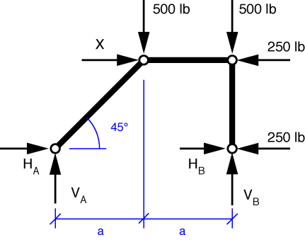
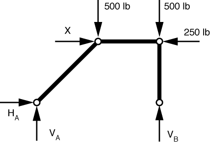
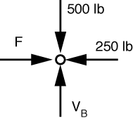
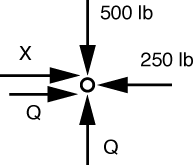

# Problem 51 #

Following our usual procedure, we find statically equivalent joint loads for each of the non-joint loads. The free-body diagram looks like this:

Ignoring, for the moment, the loads applied directly to the supports, we get this FBD:

Now everything is a two-force member, which means

* \(H_A = H_B = Q\);
* the force in the horizontal bar, *F*, is horizontal; and
* the force in the vertical is vertical and equal to the reaction force, \(V_B\).

Starting with the upper right pin, we get an FBD of

Vertical equilibrium tells us \(V_B = 500\,\rm{lbs}\); horizontal equilibrium tells us \(F = 250\,\rm{lbs}\).

The upper left pin has this FBD:

Vertical equilibrium gives us \(Q = 500\,\rm{lbs}\); horizontal equilibrium gives us \(X = -250\,\rm{lbs}\), which means that *X* is actually pulling to the left, rather than pushing to the right.

Superposition is needed to get the horizontal reaction at the right support; the others have already been calculated.

\[ H_A = V_A = 500\,\rm{lbs}\]

\[ H_B = 250\,\rm{lbs}\]

\[ V_B = 500\,\rm{lbs}\]

Den Hartog combines \(H_A\) and \(V_A\) to get a single reaction of \(500 \sqrt{2}\) at the left support, but I don't see any value in doing so (especially since he didn't combine the horizontal and vertical components in any of the other reactions).

