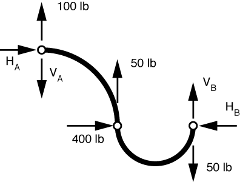
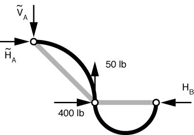
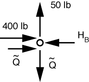

# Problem 52 #

In the last problem of this set, Den Hartog uses curved members to try to throw us off our game. But if we just follow our usual procedure and remember that the (straight) line of force in a two-force member connects the two points at which the forces are applied, we'll be fine.

After replacing the real loads with statically equivalent loads at the joints, we get this free-body diagram:

Den Hartog was nice to give us a 30° angle for the point of application of the 200 lb load. It put that load (horizontally) halfway between A and C. Ignoring, for the moment, the loads applied directly to the supports, we get

I've drawn straight lines connecting the pins as a reminder that the bar forces in this sub-problem must lie along the lines connecting the hinges. Therefore, \(\tilde H_A = \tilde V_A = \tilde Q\).

The FBD of the pin at C is

Vertical equilibrium gives us \(\tilde Q = 50\,\rm{lbs}\). Horizontal equilibrium gives us \(H_B = 400 + 50 = 450\,\rm{lbs}\).

Using superposition to add in the reactions due to the loads applied directly to the supports, we get

\[ H_A = 50\,\rm{lbs} \]

\[ V_A = 50 + 100 = 150\,\rm{lbs} \]

\[ H_B = 450\,\rm{lbs} \]

\[ V_B = 50\,\rm{lbs} \]

