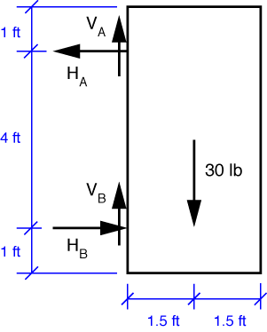

# Problem 53 #

Because the weight of the door is uniformly distributed, its center of gravity is at its geometric center. The free-body diagram looks like this:

Taking moments about the lower hinge, point B, we get the equilibrium equation

\[ \sum M_B = 30 \cdot 1.5 - H_A \cdot 4 = 0 \]

and the solution is \(H_A = 11.25\,\rm{lb}\). Horizontal equilibrium tells us that \(H_B = H_A = 11.25\,\rm{lb}\). Vertical equilibrium gives \(V_A + V_B = 30\,\rm{lb}\), but there isn't enough information to determine how that 30 lbs is split between the upper and lower hinges. Yes, it's tempting to say that each hinge carries 15 lbs, but there's no mechanical or geometric justification for it. The situation is *statically indeterminant*.

The answer in the back of the book has the directions opposite to those we've shown, but that's because the question asks for the forces the door exerts on the hinges and we've calculated the forces the hinges exert on the door. Newton's Third Law accounts for the direction difference. 
