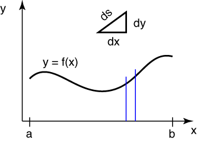

# Problem 54 #

In setting up the problems with surfaces and volumes of revolution, Den Hartog shows a preference for rotating about a vertical axis, what most people think of as the *y*-axis. This works well if the curve is expressed as a function of *y*, e.g., \(x = g(y)\). But since people tend to be more comfortable with curves expressed as function *x*, e.g., \(y = f(x)\), I find it easier to do the rotating about the *x*-axis. So the problems here will look like the problems in the book if you turn your head sideways.

Here's a curve, \(y = f(x)\).

A differential chunk of the curve has length *ds*, and the arc length is calculated by adding up (by integration) all the little chunks from one end to the other. Recall from calculus that these differential chunks are so small that they can be considered straight. Pythagoras tell us

\[ ds = \sqrt{dx^2 + dy^2} = \sqrt{1 + (dy/dx)^2} dx = \sqrt{1 + [f^\prime(y)]^2} dx \]

and so the arclength is

\[ L = \int_a^b \sqrt{1 + [f^\prime(y)]^2} dx \]

The *y* coordinate of the centroid of this arc is found by taking moments of the differential chunks about the *x*-axis, integrating these moments, then dividing the answer by the arc length.

\[ \bar y = \frac{\int_a^b f(x) \sqrt{1 + [f^\prime(y)]^2} dx}{\int_a^b \sqrt{1 + [f^\prime(y)]^2} dx} \]

The circumference of the circle swept out by this point as it rotates about the *x*-axis is

\[ 2 \pi \bar y = 2 \pi \frac{\int_a^b f(x) \sqrt{1 + [f^\prime(y)]^2} dx}{\int_a^b \sqrt{1 + [f^\prime(y)]^2} dx} \]

and multiplying this by the arclength of the original curve gives

\[ 2 \pi \int_a^b f(x) \sqrt{1 + [f^\prime(y)]^2} dx \]

The first theorem of Pappus says that this is equal to the area swept out by the curve as it rotates about the *x*-axis. To check this, we start by figuring out the area swept out by the differential chunk of curve. That will be \(2 \pi f(x) ds = 2 \pi f(x) \sqrt{1 + [f^\prime(y)]^2} dx\). Adding up the areas from all the differential chunks by integration gives us

\[ \int_a^b 2 \pi f(x) \sqrt{1 + [f^\prime(y)]^2} dx \]

or

\[ 2 \pi \int_a^b f(x) \sqrt{1 + [f^\prime(y)]^2} dx \]

which proves the theorem.

