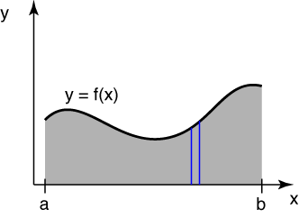

# Problem 55 #

As with the last problem, we start with a curve, \(y = f(x)\), and rotate it about the *x*-axis. This time, however, we're going to be looking at the area under the curve and the volume it sweeps out as it rotates.

The diagram we'll be working from is this:

The area under the curve is, of course

\[ \int_a^b f(x) dx \]

which is the sum, or integral, of all the little differential slices of width *dx*. The *y* coordinate of the centroid of this area is found by taking the moments of all the differential slices, integrating over the domain, and dividing the result by the area under the curve.

\[ \bar y = \frac{\int_a^b 1/2 [f(x)]^2 dx}{\int_a^b f(x) dx} \]

The circumference of the circle swept out by the centroid is

\[ 2 \pi \bar y = \pi \frac{\int_a^b [f(x)]^2 dx}{\int_a^b f(x) dx} \]

and the product of this circumference and the area under the curve is

\[ \pi \int_a^b [f(x)]^2 dx \]

The second theorem of Pappus states that this is equal to the volume swept out by the area as it rotates about the *x*-axis. To check this, we start by working out the volume swept out by each differential slice: \(\pi [f(x)]^2 dx\). Integrating all these differential cylinders over the domain of the curve gives

\[ \int_a^b \pi [f(x)]^2 dx = \pi \int_a^b [f(x)]^2 dx \]

which proves the theorem.

