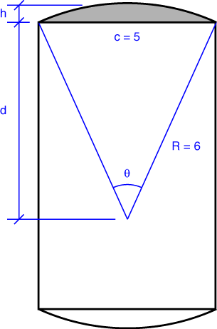

# Problem 62 #

This is another one of those problems where an engineering student of a couple of generations ago would have happily whipped out his compass and T-square and solved it graphically, just as Den Hartog asks. Today's students are slower at drawing but faster at calculating, so we're going to do this one analytically.

The cheeks are composite bodies; each comprises a rectangle with a circular segment at either end. To make our calculations, we'll need to get the height and area of the circular segments. You can either

1. do some integration;
2. look it up in a handbook; or
3. look it up at [MathWorld][1].

Here's the layout, using the notation from MathWorld.

Plugging in the values from our problem, we get

\[ d = \frac{1}{2}\sqrt{4 R^2 - c^2} = 5.4544\,\rm{in} \]

\[ h = R - d = 0.5456\,\rm{in} \]

\[ \theta = 2 \sin^{-1}\frac{c}{2R} = 0.8596\,\rm{rad} \]

\[ A_{seg} = \frac{1}{2}R^2 (\theta - \sin\theta) = 1.836\,\rm{in^2} \]

The height of the rectangle, then is \(9 - 2h = 7.9087\,\rm{in}\), and its area is \(39.544\,\rm{in^2}\). This makes the volume of each cheek 

\[ V_{cheek} = 2 \cdot (39.544 + 2\cdot 1.836) = 86.432\,\rm{in^3} \]

The symmetry of the cheek tells us immediately that its centroid is at the center of the rectangle part. We don't need to do any calculations for this.

The volume of the pin is, of course

\[ V_{pin} = 4 \pi (3/2)^2 = 28.274\,\rm{in^3} \]

Taking the center of the pin as the origin of our coordinate system, with the *z* axis pointing up, the c.g. of the entire crank is

\[ \bar z = \frac{2\cdot 86.432\cdot (-1.5) + 28.274\cdot 0}{2\cdot 86.432 + 28.274} = -1.289\,\rm{in} \]

or, dropping the excessive number of digits we've been carrying, 1.29 inches below the center of the pin. Den Hartog gets 1.28 inches, which is pretty good.

There's no point in our trying to do the error estimation of part b) because we didn't do any graphical construction.

[1]: http://mathworld.wolfram.com/CircularSegment.html

