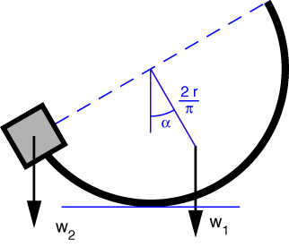

# Problem 64 #

I'm not sure of the practical applications of this problem, but it is cute. The c.g. of the semicircular arc is \(2r/\pi\) from the center of the arc (which you can confirm [here][1]), so the free-body diagram will look like this

and the moment equilibrium about the point of contact with the ground gives us

\[ w_1  \frac{2 r}{\pi} \sin\alpha = w_2 r \cos\alpha \]

A bit of algebra gives us

\[ \frac{w_1}{w_2} = \frac{\pi}{2 \tan\alpha} \]

which is equivalent to the answer given in the back of the book. I prefer giving answers in terms of tangent because they can be entered in a calculator more directly--calculators don't have a cotangent key.

[1]: http://mathworld.wolfram.com/Semicircle.html

