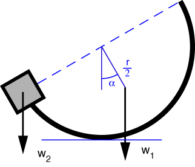
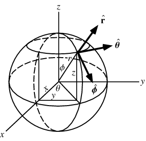

# Problem 65 #

The surface area of the hemispherical shell is \(2\pi r^2\) and its centroid is \(r/2\) from its center. Except for one dimension, the free-body diagram for this problem looks just like the one for [Problem 64][1].

Moment equilibrium about the point of contact with the ground gives

\[ w_1 \frac{r}{2} \sin\alpha = w_2 r \cos\alpha  \]

So

\[ \frac{w_1}{w_2} = \frac{2}{\tan\alpha} \]

Where did I come up with the centroid of the hemispherical surface? In this case, I actually did the integration. To make life easier, I did the problem in [spherical coordinates][2], \( (r, \theta, \phi) \), which are defined in this drawing that I pulled from the [MathWorld page][2]:

A differential patch on the surface has the area

\[ dA = r^2 \sin\phi\, d\phi\,d\theta \]

and its *z* coordinate is \(r \cos\phi\)

The centroid of the upper hemispherical surface, then, is

\[ \bar z = \frac{\int_0^{2\pi} \int_0^{\pi/2} r^3 \sin\phi\, \cos\phi\, d\phi\, d\theta}{\int_0^{2\pi} \int_0^{\pi/2} r^2 \sin\phi\, d\phi\, d\theta} = \frac{\pi r^3}{2 \pi r^2} = \frac{r}{2} \]

[1]: problem064.html
[2]: http://mathworld.wolfram.com/SphericalCoordinates.html

