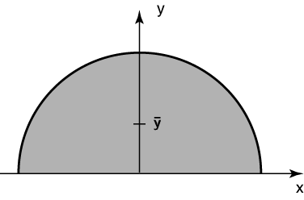

# Problem 67 #

Here, we're using the second theorem of Pappus in a sort of backwards way: we know the volume of a sphere is \(\frac{4}{3}\pi r^3\) and we know the area of a semicircle is \(\frac{1}{2}\pi r^2\). If we consider our semicircle to be above the *x* axis as in this figure

the circumference traversed by the centroid as it's rotated about the *x* axis is \(2\pi \bar y\). So

\[ \frac{1}{2}\pi r^2 \cdot 2\pi \bar y = \frac{4}{3}\pi r^3 \]

and \(\bar y = \frac{r}{3}\).
