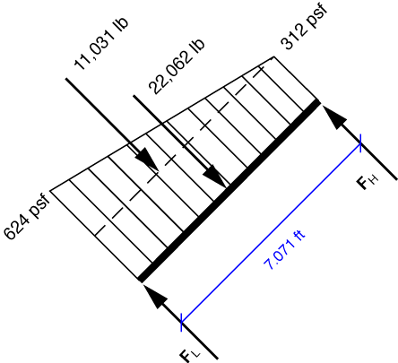

# Problem 68 #

The pressure on the door is perpendicular to the door and equal to the product of the water's unit weight of 62.4 pcf and the water's depth. The free-body diagram for the door is

We've broken the trapezoidal distributed pressure into a constant pressure of 312 pcf and a triangular pressure with maximum of 312 pcf at the lower part of the door. The resultant forces are

\[312 \cdot 7.071 \cdot 10 = 22,062\,\rm{lb}\]

for the constant pressure, and

\[ \frac{1}{2} \cdot 312 \cdot 7.071 \cdot 10 = 11,031\,\rm{lb}\]

for the triangular pressure. These resultants are located one-half and one-third, respectively, of the distance from the lower end of the door. Moment equilibrium about the lip at the bottom of the door gives us

\[ \sum M_L = 22,062\cdot\frac{7.071}{2} + 11,031\cdot\frac{7.071}{3} - F_H\cdot7.071 = 0 \]

Solving gives us \(F_H = 14,708\,\rm{lb}\). Force equilibrium in the direction perpendicular to the door gives us

\[ F_L = 22,062 + 11,031 - 14,708 = 18,385\,\rm{lb} \]

The answers in the back of the book match these figures (after rounding off), but the directions given in the book are wrong. The book says these reaction forces are "directed vertically to the door." Clearly, the correct answer is that they are "directed perpendicularly to the door."

